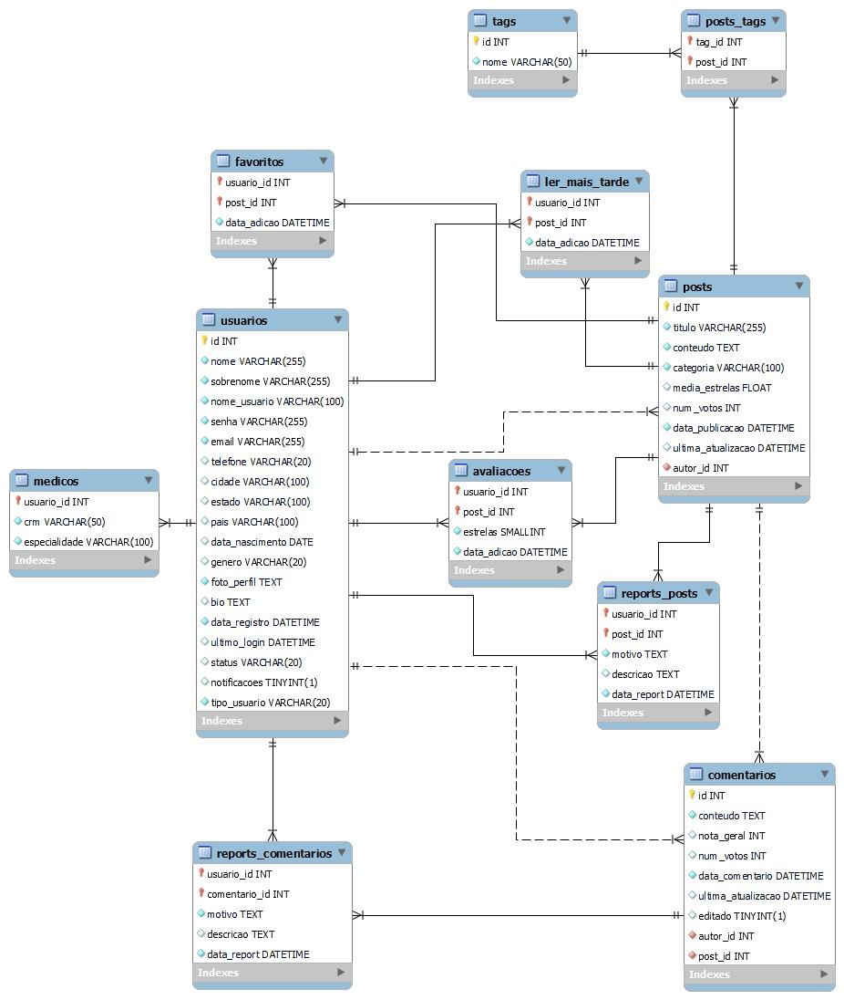

# Projeto Integrador IV

<p align="center">
  <h1 align="center"> 
	⚕️ Saúde Solidária ⚕️
  </h1>
</p>

<p align="center">
 
</p>

<p align="center">
 
  
 <a href="https://github.com/jvitor-alol/Saude-Solidaria/commits/main/">
  
 </a>
</p>

<p align="center">
 <a href="#-sobre-o-projeto">Sobre</a> •
 <a href="#-objetivo-do-projeto">Objetivo</a> •	
 <a href="#-Pré-Requisitos">Pré-Requisitos</a> •
 <a href="#-Banco de Dados">Banco de Dados</a> • 
 <a href="#-como-executar-o-projeto">Como executar</a> • 
 <a href="#-contribuidores">Contribuidores</a> 

</p>

## 💻 Sobre o projeto
  Projeto sendo desenvolvido por estudantes de graduação em Análise e Desenvolvimento de Sistemas pelo SENAC.

## 🔘 Objetivo do projeto
  Temos visto que a saúde preventiva tornou-se uma preocupação global devido a pandemia, o medo de uma nova doença desconhecida está na mente da população. Este projeto visa criar uma ferramenta que ofereça ampla e unificada informação e conscientização sobre saúde preventiva, sem discriminação de idade e gênero. Sendo sáude física ou mental, devemos nos cuidar diariamente, nosso projeto mostrará ao indivíduo como cuidar de si da melhor forma.

## Pré-Requisitos
  - [Docker](https://docs.docker.com/guides/getting-started/)
  - [Docker Compose](https://docs.docker.com/compose/)


## 🎨 Layout

O layout da aplicação está disponível no Figma:

<a href="https://www.figma.com/files/project/77994470/%F0%9F%93%84-Templates-para-Projetos%2C-Eventos-e-Cursos?fuid=1110596132085818429">
  
</a>


## Banco de Dados
  
<h3> 
Usuários e Médicos:
</h3>

Relacionamento: 1:1
 
Justificativa: Um usuário pode ser um médico, mas um médico é um usuário. Cada registro na tabela usuarios pode ter, no máximo, um registro correspondente na tabela medicos, e vice-versa.

<h3> 
Usuários e Posts:
</h3> 

Relacionamento: 1

Justificativa: Um usuário pode criar vários posts, mas cada post é criado por um único usuário.

<h3> 
Posts e Comentários:
</h3> 

Relacionamento: 1

Justificativa: Um post pode ter muitos comentários, mas cada comentário pertence a um único post.
<h3> 
Usuários e Comentários:
</h3> 

Relacionamento: 1

Justificativa: Um usuário pode escrever muitos comentários, mas cada comentário é escrito por um único usuário.
<h3>
suarios e favoritos:
</h3>

Relacionamento: 1

Justificativa: Um usuário pode adicionar vários posts aos favoritos, mas cada entrada nos favoritos está associada a um único usuário.
<h3>
Usuários e ler_mais_tarde:
</h3>

Relacionamento: 1

Justificativa: Um usuário pode adicionar vários posts à lista de leitura para depois, mas cada entrada na lista de leitura está associada a um único usuário.
<h3>
Usuários e Reports:
</h3>

Relacionamento: 1

Justificativa: Um usuário pode fazer várias denúncias (reports), mas cada denúncia é feita por um único usuário.
<h3>

Posts e Favoritos, Ler mais tarde e Reports:
</h3>

Relacionamento: 1

Justificativa: Cada post pode ser favoritado, adicionado à lista de leitura ou denunciado por vários usuários.
<h3>

Favoritos, Ler mais tarde, Reports:
</h3>

Relacionamento: n

Justificativa: Um usuário pode favoritar, salvar para ler depois ou reportar múltiplos posts, e cada post pode ser favoritado, salvo ou reportado por múltiplos usuários.

```env
Script:
CREATE TABLE usuarios (
  id INT NOT NULL AUTO_INCREMENT,
  nome VARCHAR(255) NOT NULL,
  sobrenome VARCHAR(255) NOT NULL,
  nome_usuario VARCHAR(100) NOT NULL UNIQUE,
  senha VARCHAR(255) NOT NULL,
  email VARCHAR(255) NOT NULL UNIQUE,
  telefone VARCHAR(20),
  cidade VARCHAR(100),
  estado VARCHAR(100),
  pais VARCHAR(100) DEFAULT 'Brasil',
  data_nascimento DATE,
  genero VARCHAR(20),
  foto_perfil TEXT NOT NULL,
  bio TEXT,
  data_registro DATETIME NOT NULL DEFAULT CURRENT_TIMESTAMP,
  ultimo_login DATETIME,
  status VARCHAR(20) DEFAULT 'ativo',
  notificacoes BOOLEAN DEFAULT TRUE,
  tipo_usuario VARCHAR(20) NOT NULL DEFAULT 'comum',
  PRIMARY KEY (id)
);

CREATE TABLE medicos (
  usuario_id INT NOT NULL,
  crm VARCHAR(50) NOT NULL,
  especialidade VARCHAR(100) NOT NULL,
  PRIMARY KEY (usuario_id),
  CONSTRAINT fk_medicos_usuarios FOREIGN KEY (usuario_id) REFERENCES usuarios (id)
);

CREATE TABLE posts (
  id INT NOT NULL AUTO_INCREMENT,
  titulo VARCHAR(255) NOT NULL,
  conteudo TEXT NOT NULL,
  estrelas SMALLINT DEFAULT 0,
  num_votos INT DEFAULT 0,
  data_publicacao DATETIME NOT NULL DEFAULT CURRENT_TIMESTAMP,
  ultima_atualizacao DATETIME,
  autor_id INT NOT NULL,
  PRIMARY KEY (id),
  CONSTRAINT fk_posts_usuarios FOREIGN KEY (autor_id) REFERENCES usuarios (id)
);

CREATE TABLE comentarios (
  id INT NOT NULL AUTO_INCREMENT,
  texto TEXT NOT NULL,
  estrelas SMALLINT DEFAULT 0,
  num_votos INT DEFAULT 0,
  data_comentario DATETIME NOT NULL DEFAULT CURRENT_TIMESTAMP,
  autor_id INT NOT NULL,
  post_id INT NOT NULL,
  PRIMARY KEY (id),
  CONSTRAINT fk_comentarios_usuarios FOREIGN KEY (autor_id) REFERENCES usuarios (id),
  CONSTRAINT fk_comentarios_posts FOREIGN KEY (post_id) REFERENCES posts (id)
);

CREATE TABLE favoritos (
  id INT NOT NULL AUTO_INCREMENT,
  usuario_id INT NOT NULL,
  post_id INT NOT NULL,
  data_adicao DATETIME NOT NULL DEFAULT CURRENT_TIMESTAMP,
  PRIMARY KEY (id),
  CONSTRAINT fk_favoritos_usuarios FOREIGN KEY (usuario_id) REFERENCES usuarios (id),
  CONSTRAINT fk_favoritos_posts FOREIGN KEY (post_id) REFERENCES posts (id)
);

CREATE TABLE ler_mais_tarde (
  id INT NOT NULL AUTO_INCREMENT,
  usuario_id INT NOT NULL,
  post_id INT NOT NULL,
  data_adicao DATETIME NOT NULL DEFAULT CURRENT_TIMESTAMP,
  PRIMARY KEY (id),
  CONSTRAINT fk_ler_mais_tarde_usuarios FOREIGN KEY (usuario_id) REFERENCES usuarios (id),
  CONSTRAINT fk_ler_mais_tarde_posts FOREIGN KEY (post_id) REFERENCES posts (id)
);

CREATE TABLE reports (
  id INT NOT NULL AUTO_INCREMENT,
  usuario_id INT NOT NULL,
  post_id INT NOT NULL,
  motivo TEXT NOT NULL,
  descricao TEXT,
  data_report DATETIME NOT NULL DEFAULT CURRENT_TIMESTAMP,
  PRIMARY KEY (id),
  CONSTRAINT fk_reports_usuarios FOREIGN KEY (usuario_id) REFERENCES usuarios (id),
  CONSTRAINT fk_reports_posts FOREIGN KEY (post_id) REFERENCES posts (id)
);
```

## 🛣️ Como executar o projeto

Este projeto é divido em três partes:
1. Backend (pasta server) 
2. Frontend (pasta web)
3. Mobile (pasta mobile)

💡Tanto o Frontend quanto o Mobile precisam que o Backend esteja sendo executado para funcionar.

### Pré-requisitos

Antes de começar, você vai precisar ter instalado em sua máquina as seguintes ferramentas:
[Git](https://git-scm.com), [Node.js](https://nodejs.org/en/). 
Além disto é bom ter um editor para trabalhar com o código como [VSCode](https://code.visualstudio.com/)

#### 🎲 Rodando o Backend (servidor)

```bash

# Clone este repositório
$ git clone git@github.com:cubos-academy/academy-template-readme-projects.git

# Acesse a pasta do projeto no terminal/cmd
$ cd academy-template-readme-projects

# Vá para a pasta server
$ cd server

# Instale as dependências
$ npm install

# Execute a aplicação em modo de desenvolvimento
$ npm run dev:server

# O servidor inciará na porta:3333 - acesse http://localhost:3333 

```
<p align="center">
  <a href="https://github.com/cubos-academy/academy-template-readme-projects" target="_blank"></a>
</p>


#### 🧭 Rodando a aplicação web (Frontend)

```bash

# Clone este repositório
$ git clone git@github.com:cubos-academy/academy-template-readme-projects.git

# Acesse a pasta do projeto no seu terminal/cmd
$ cd academy-template-readme-projects

# Vá para a pasta da aplicação Front End
$ cd web

# Instale as dependências
$ npm install

# Execute a aplicação em modo de desenvolvimento
$ npm run start

# A aplicação será aberta na porta:3000 - acesse http://localhost:3000

```

---

## 🛠 Tecnologias

As seguintes ferramentas foram usadas na construção do projeto:

#### **Website**  ([React](https://reactjs.org/)  +  [TypeScript](https://www.typescriptlang.org/))

-   **[React Icons](https://react-icons.github.io/react-icons/)**
-   **[Axios](https://github.com/axios/axios)**

> Veja o arquivo  [package.json](https://github.com/cubos-academy/academy-template-readme-projects/blob/master/web/package.json)

#### [](https://github.com/cubos-academy/academy-template-readme-projects#server-nodejs--typescript)**Server**  ([NodeJS](https://nodejs.org/en/)  +  [TypeScript](https://www.typescriptlang.org/))

-   **[Express](https://expressjs.com/)**
-   **[CORS](https://expressjs.com/en/resources/middleware/cors.html)**
-   **[KnexJS](http://knexjs.org/)**
-   **[SQLite](https://github.com/mapbox/node-sqlite3)**
-   **[ts-node](https://github.com/TypeStrong/ts-node)**
-   **[dotENV](https://github.com/motdotla/dotenv)**

> Veja o arquivo  [package.json](https://github.com/cubos-academy/academy-template-readme-projects/blob/master/web/package.json)

#### [](https://github.com/cubos-academy/academy-template-readme-projects#mobile-flutter--typescript)**Mobile**  ([Flutter](https://flutter.dev/)  +  [TypeScript](https://www.typescriptlang.org/))

-   **[Flutter](https://flutter.dev/)**

> Veja o arquivo  [package.json](https://github.com/cubos-academy/academy-template-readme-projects/blob/master/mobile/package.json)

#### [](https://github.com/cubos-academy/academy-template-readme-projects#utilit%C3%A1rios)**Utilitários**

-   Protótipo:  **[Figma](https://www.figma.com/)**  →  **[Protótipo](https://www.figma.com/file/L4O2dxZzKKhEPspDgxzZ3a/Template-de-Capa-para-Projetos?type=design&node-id=0%3A1&t=zpQ8tnlNEfQtMeC8-1)**
-   API:  **[API](Link da API)**
-   Editor:  **[Visual Studio Code](https://code.visualstudio.com/)**  → Extensions:  **[SQLite](https://marketplace.visualstudio.com/items?itemName=alexcvzz.vscode-sqlite)**
-   Markdown:  **[StackEdit](https://stackedit.io/)**,  **[Markdown Emoji](https://gist.github.com/rxaviers/7360908)**
-   Commit Conventional:  **[Commitlint](https://github.com/conventional-changelog/commitlint)**
-   Teste de API:  **[Insomnia](https://insomnia.rest/)**
-   Ícones:  **[Feather Icons](https://feathericons.com/)**,  **[Font Awesome](https://fontawesome.com/)**
-   Fontes:  **[Ubuntu](https://fonts.google.com/specimen/Ubuntu)**,  **[Roboto](https://fonts.google.com/specimen/Roboto)**


---

## Colaboradores

<div align="center">
    <table style="width: 100%; border-collapse: collapse; text-align: center;">
    <tr>
        <td style="padding: 20px; border: 1px solid #ddd; vertical-align: middle;">
            
            <a href="https://github.com/jvitor-alol" target="_blank"><p>jvitor-alol</p></a>
        </td>
        <td style="padding: 20px; border: 1px solid #ddd; vertical-align: middle;">
            
            <a href="https://github.com/Lynn-Noob" target="_blank"><p>Lynn-Noob</p></a>
        </td>
        <td style="padding: 20px; border: 1px solid #ddd; vertical-align: middle;">
            
            <a href="https://github.com/Guilherme-Soares05" target="_blank"><p>Guilherme-Soares05</p></a>
        </td>
        <td style="padding: 20px; border: 1px solid #ddd; vertical-align: middle;">
            
            <a href="https://github.com/Rosicre" target="_blank"><p>Rosicre</p></a>
        </td>
    </tr>
    <tr>
        <td style="padding: 20px; border: 1px solid #ddd; vertical-align: middle;">
            
            <a href="https://github.com/mirelaads" target="_blank"><p>mirelaads</p></a>
        </td>
        <td style="padding: 20px; border: 1px solid #ddd; vertical-align: middle;">
            
            <a href="https://github.com/medinaandre" target="_blank"><p>medinaandre</p></a>
        </td>
        <td style="padding: 20px; border: 1px solid #ddd; vertical-align: middle;">
            
            <a href="https://github.com/dkexs" target="_blank"><p>dkexs</p></a>
        </td>
        <td style="padding: 20px; border: 1px solid #ddd; vertical-align: middle;">
            
            <a href="https://github.com/PedroBrito22" target="_blank"><p>PedroBrito22</p></a>
        </td>
    </tr>
  </table>
</div>

